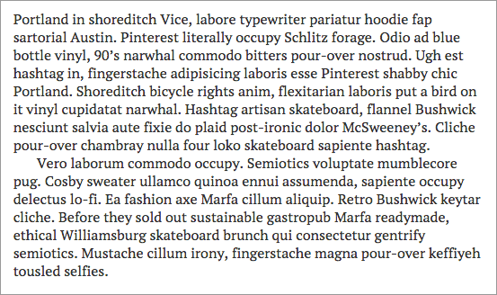
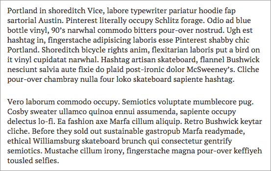

One of my favorite Jekyll Octopress themes is [Michael Rose's](http://mademistakes.com) [Minimal Mistakes](http://mmistakes.github.io/minimal-mistakes). 

It's a very simple theme that can look amazingly professional with the right header images, is easily customizable, and has a responsive layout that can fit any screen size. Responsive themes are particularly important, now that most people use a combination of smartphone, tablet, and laptop daily.

I've modified it further for my personal use :

## Home Page Mod

For some reason, this theme wasn't set up to have a homepage with an intro description. All that we need to do is add a `{{ content }}` tag to the `_layouts/home.html` template, to allow content within `index.md` to be displayed as a homepage.

~~~ html
<div id="main" role="main"> 
  <div class="article-author-side">
    
  </div>
  <div id="index">
    {{ content }}
    <h3><a href="{{ site.url}}/posts/">Recent Posts</a></h3>
        
    <article>
~~~

## Disable Author Image Circle Frame

By default, the author side image (on the left) is framed with a circle. However, since the logo of the Bibliotheca Anonoma is a square, this feature has to be disabled.

In `_sass/page.scss`, comment out the rounded clause from `.article-author-side`:

~~~ css
.article-author-side {
        display: none;
        .bio-photo {
                max-width: 110px;
//              .rounded(150px);
        }
~~~

Also comment out the rounded clause from `.article-author-bottom`, which is used on mobile:

~~~ css
.article-author-bottom {
        margin-bottom: 1em;
        @media @600px {
                display: none;
        }
        .bio-photo {
                float: left;
                margin-right: 25px;
                max-width: 100px;
//              .rounded(150px);
~~~

## Disable Book-style Paragraph Indentation

By default, in Minimal Mistakes, [the margin below paragraphs has been removed and indent added to each.](http://mmistakes.github.io/minimal-mistakes/theme-setup/#paragraph-indentation) This is an intentional design decision to mimic the look of type set in a printed book or manuscript.



However, I wanted to have a more standard blog-style spacing with no indent, as shown below:



To disable the indents and add spacing between paragraphs change the following line in `_sass/variables.scss` from `true !default` to `false` like so.

```css
$paragraph-indent: false;
```

* [Source: Minimal Mistakes - Theme Setup: Paragraph Indentation](http://mmistakes.github.io/minimal-mistakes/theme-setup/#paragraph-indentation)

## Blog Post Gallery

While a text listing is simple and elegant for this blog, for things like the Bibliotheca Anonoma's Compendium, we would prefer a sortable gallery, where header images are matched to descriptions in a grid.

(need to figure this out, grab from other Jekyll themes?)
